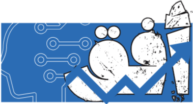

<!DOCTYPE html>
<html lang="ar" dir="rtl">
<head>
  <meta charset="UTF-8">
  <meta name="viewport" content="width=device-width, initial-scale=1.0">
  <title>مشروع أفق </title>
  
</head>
<body>
  

    <h1>أفق</h1>

    <!-- فقرة تحت العنوان -->
    

      
مرحبا بك.أفق هو نظام ذكاء اصطناعي هدفه الأول والأخير هو مساعدتك في إدارة مشروعك. .

    

    <!-- البطاقات -->
    

      

        
الشعار

        

          <h2>الشعار</h2>
          
 صنع الشعار من قبل(المجموعة الاولى) 
          صمم بعناية حيث يحمل عده
          معاني يرمز الاسم إلى التوسع والافق التي لا نهايه لها ويرمز اللون الازرق للزدهار    

        

      

      
      
      <!-- البطاقات -->
    

      

        
الفريق المسؤول 

        

          <h2> الفريق المسؤول </h2>
          
 تم الاشراف على المشروع من قبل الاستاذه بدريه العنزي وتم تنفيذه من قبل طالبات المجموعة الاولى (ندى فيصل، رغد عبدالله، لميس عبدالله، عيدة الرشيدي) 

        

      

    

    <!-- صورة أسفل البطاقات -->
    

      
    

  

  
</body>
</html>
